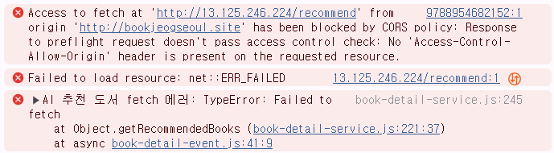
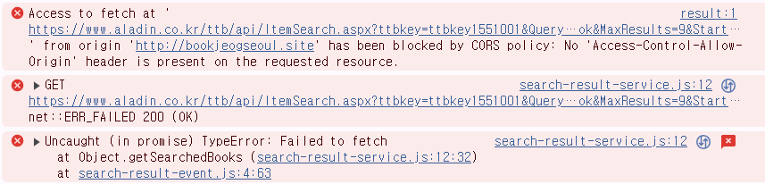
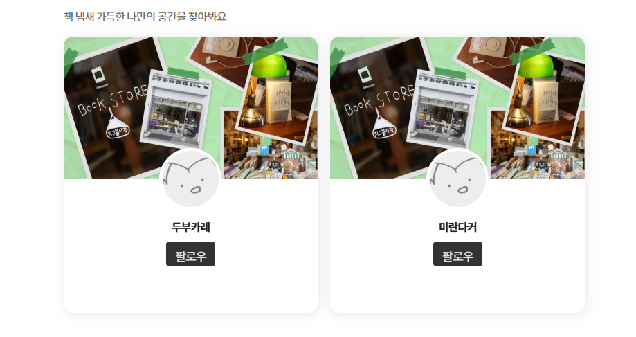

# bookjeogseoul

# 독서와 나눔이 공존하는 독서 커뮤니티, 북적서울.

## 1. 기획 의도


한국인들의 2013~2023년 종합독서율 추이를 조사해 봤을 때, 만 19세 이상 성인들의 독서율은 무려 <strong>29.2%</strong>나 감소한 <strong>43.0%</strong>였다.<br>
이는 한 해동안 책을 읽는 성인이 두 명 중에 한 명도 채 되지 않는다는 말이다.

이런 문제를 보고 종이책 독서율을 높이고 독서 문화를 확신시킬 수는 없을까 고민하게 되었다.

이에 따라 우리는 독후감으로 <strong>독서 경험을 공유</strong>하고 <strong>맞춤형 추천도서 시스템</strong>을 활용한 새로운 <strong>기부형 독서 플랫폼</strong>을 만들기로 하였다.

## 2. 기대 효과


모든 사람들에게 독서의 기회를 제공하고 사람들과 함께 독서에 참여할 수 있게 한다.

독서 활동의 보상으로 기부에 동참하게 만들며,
이는 독서를 할 때의 성취감과 동기부여가 된다.<br>
독후감으로 독서 경험을 공유하고 의견도 나눌 수 있으며,<br>
후원단체와의 연결을 통해 직접적으로 도서를 전달할 수 있는 기회도 제공한다.

## 3. 프로젝트 사용 툴

-   Java
-   JavaScript
-   Apache Tomcat
-   MySQL
-   Spring Boot
-   Visual Studio Code
-   DBeaver
-   IntelliJ
-   PyCharm
-   PyTorch
-   FastAPI
-   Sourcetree
-   git, github
-   JSON
-   Ajax
-   JDK 17.0.10
-   Aladin API
-   Slack

## 4. ERD


## 5. 담당 업무

#### 5-1 퍼블리싱


▶ 통합 검색 페이지

-   검색창 페이지
-   통합 검색 결과
-   카테고리별 검색 결과

▶ 도서 페이지

-   도서 상세정보(반응형)
-   도서로 써진 독후감들(반응형)

▶ 메인 페이지

-   고정 헤더(반응형)

▶ 독후감

-   독후감 피드
-   독후감 상세보기
-   독후감 작성
-   독후감 수정

▶ 개인 마이페이지

-   메인 정보영역
-   내 도서 스크랩 목록
-   마일리지 조회
-   비밀번호 확인
-   개인 정보 수정
-   계정 탈퇴
-   계정 탈퇴사유

▶ 후원단체 마이페이지

-   메인 정보영역
-   내 기부글/기부인증글 목록
-   비밀번호 확인
-   개인 정보 수정
-   계정 탈퇴
-   계정 탈퇴사유

▶ 사이트 소개

#### 5-2 서버


▶ 통합검색

-   검색기능, 쿠키로 검색기록 저장
-   항목별 검색어에 맞는 결과 조회(도서/독후감/토론방/단체/기부글)

▶ 도서 상세

-   알라딘 API를 사용한 도서 정보 조회
-   FastAPI를 사용하여 회원별 도서 조회 기록과 유사도 검색을 통한 AI 맞춤 도서 추천 시스템
-   도서별로 작성된 독후감 리스트
-   도서 스크랩, 해당 도서로 독후감 작성 기능
-   해당 도서를 쓴 작가의 다른 도서 목록

▶ 독후감

-   알라딘 API를 사용해 독후감을 작성할 도서를 검색
-   제목, 내용, 기간 등 독후감 필수 항목과 10개까지 첨부 가능한 첨부 이미지를 넣어 독후감 작성 기능 제공
-   독후감 공개여부, 선정도서면 독후감 투표 지원여부 선택 가능
-   작성한 독후감도 내용, 공개여부 등 수정 가능
-   다른 회원이 작성한 독후감은 조회 페이지에서 신고, 좋아요, 팔로우 가능

▶ 개인회원 마이페이지

-   프로필사진, 닉네임, 팔로우&팔로워와 작성한 독후감 개수, 마일리지 등 회원 정보 조회
-   회원별로 스크랩한 도서 목록을 마이페이지에서 조회 가능
-   회원 정보 변경 시 비밀번호 확인 후 페이지 이동
-   프로필사진 삭제, 변경과 이메일, 비밀번호 등 개인회원 정보를 조회 및 수정
-   내 활동내역 조회 후 탈퇴 기능

▶ 단체회원 마이페이지

-   대표 이미지, 단체 이름, 기부글 등 회원 정보 조회
-   작성한 기부글/기부인증글 마이페이지에서 조회 가능
-   회원 정보 변경 시 비밀번호 확인 후 페이지 이동
-   대표 이미지 삭제, 변경과 이메일, 비밀번호 등 개인회원 정보를 조회 및 수정
-   내 활동내역 조회 후 탈퇴 기능

## 6. 트러블 슈팅(오류, 해결)

## 6-1. 퍼블리싱

### 1. 문제

📌 캘린더 라이브러리에서 시작~끝 날짜 두 개가 선택이 안 되는 현상

```
const fp = flatpickr(dateInput, {
        mode: "multiple",
        dateFormat: "Y.m.d", // 예: 2025.04.03 형식
        appendTo: calendarContainer,
        onChange: function (selectedDates, dateStr, instance) {
            if (selectedDates.length === 2) {
                const start = instance.formatDate(selectedDates[0], "Y.m.d");
                const end = instance.formatDate(selectedDates[1], "Y.m.d");
                const rangeText = `${start} ~ ${end}`;
```

<문제 코드><br>
독후감 작성 페이지에서 flatpickr 라이브러리를 사용해 "시작일 ~ 종료일" 형식의 독서 기간을 지정하려고 했다.

<br>
<오류 화면><br>
의도한 동작이 되지 않고 여러 개의 날짜가 선택만 되는 상황 발생.

### 2. 해결

```
const fp = flatpickr(dateInput, {
        mode: "range", // 2025.04.03~2025.04.10 이렇게 기간을 설정
        dateFormat: "Y.m.d", // 예: 2025.04.03 형식
        appendTo: calendarContainer,
        onChange: function (selectedDates, dateStr, instance) {
            // 날짜가 두 개 모두 선택되면
            if (selectedDates.length === 2) {
                const start = instance.formatDate(selectedDates[0], "Y.m.d");
                const end = instance.formatDate(selectedDates[1], "Y.m.d");
                const rangeText = `${start} ~ ${end}`;
```

<완성 코드><br>
🔍mode: "range"를 사용하여 원하는 형식으로 기간을 지정했다.<br>

이렇게 하면 캘린더에서 날짜 두개를 클릭하여 지정했을 때,<br>
시작일~종료일로 기간을 설정할 수 있게 되었다.

✔ flatpickr의 mode 옵션에는 다음의 설정이 있다.<br>
`single` - 하나의 날짜만 선택할 수 있는 모드(기본값)<br>
`multiple` - 여러개의 날짜를 선택할 수 있는 모드<br>
`range` - 시작일과 종료일을 선택하여 기간을 선택하는 모드<br>
`time` - 날짜 없이 시간만 선택하는 모드<br><br><br><br>

### 1. 문제

📌 카카오로 링크 공유하기 버튼을 눌러도 아무 반응이 없고 에러로그가 뜸

```
document.addEventListener("DOMContentLoaded", () => {
    if (window.Kakao && !Kakao.isInitialized()) {
        Kakao.init("16c74ba60369da3eb1ee0b92f425d32e");
        console.log("Kakao 초기화 완료");
    } else if (!window.Kakao) {
        console.error("❌ Kakao SDK 로딩 실패");
        return;
    }
```

<문제 코드><br>
카카오톡 공유 기능을 위해 kakao developers에 있는 키를 정상적으로 입력했으나 "kakao 초기화 완료"라는 로그가 뜨지 않고 실행도 안 됨.

<br>
<오류 화면><br>
공유 버튼을 눌러도 실행이 안 되고 에러 로그만 출력.

### 2. 해결

```
        <!-- 카카오 공유 api -->
        <script src="https://developers.kakao.com/sdk/js/kakao.min.js"></script>
    </head>
    <body>
```

<완성 코드><br>
🔍카카오톡 공유 기능을 사용하기 위해 Kakao JavaScript SDK를 `<script>` 태그로 HTML에 직접 불러왔다.<br>

이 스크립트는 공유 버튼 클릭 시 Kakao.Share.sendDefault()와 같은 메서드를 사용할 수 있게 해주는 핵심 라이브러리다.

✔ 이 태그는 반드시 `<body>`보다 <strong>위쪽(head나 상단)</strong>에 위치해야 하며, Kakao.init() 호출 전에 로딩되어 있어야 한다.<br><br><br><br>

### 1. 문제

📌 슬라이드 요소가 스크롤되지 않음

```
.report-container .slide-container {
    overflow: hidden;
    cursor: grab;
    scrollbar-width: none;
    margin: 0 -24px;
}
```

<문제 코드><br>
`.slide-container` 안에 가로로 콘텐츠(예: 카드형 슬라이드)가 배치되어 있다.

<br>
<문제 화면><br>
마우스로 스크롤하거나 드래그하려 해도 전혀 움직이지 않음.

### 2. 해결

```
.report-container .slide-container{
    overflow: scroll; // 항상 스크롤 표시
    cursor: grab;
    scrollbar-width: none;
    margin: 0 -24px;
}
```

<완성 코드><br>
🔍overflow: scroll을 통해 영역이 컨테이너보다 크면 스크롤로 움직일 수 있게 하였다.<br>

슬라이드형 콘텐츠에서는 보통 overflow-x: `auto` 또는 `scroll`을 사용해 스크롤 동작을 허용해야 하며,<br>
내부 아이템의 레이아웃도 줄바꿈 없이 가로로 배치되도록 구성해야 한다.

✔ overflow: `hidden`은 스크롤바와 넘치는 콘텐츠를 완전히 숨겨서 스크롤 자체가 불가능하다. <br><br><br><br>

### 1. 문제

📌 이미지를 하나만 바꾸려 했지만 전체 미리보기가 날아가는 현상 발생

```
inputFile.addEventListener("change", () => {
    const file = inputFile.files[0];
    if (!file) return;

    const ext = file.name.split(".").pop().toLowerCase(); // 확장자명
    const allowed = ["jpg", "jpeg", "png"]; // 허용된 파일형식
    if (!allowed.includes(ext)) {
        alert("지원하지 않는 이미지 형식입니다.");
        return;
    }

    previewList.innerHTML = "";
    const newUrl = URL.createObjectURL(file);
    img.src = newUrl;
});
```

<문제 코드><br>
이미지 변경 버튼을 눌렀을 때, 특정 첨부파일의 이미지만 바꾸려 했다.

<br>
<오류 화면><br>
하나의 이미지 변경 시도 → 전체가 사라지고 새 이미지도 보이지 않는다.

### 2. 해결

```
inputFile.addEventListener("change", () => {
    const file = inputFile.files[0];
    if (!file) return;

    const ext = file.name.split(".").pop().toLowerCase(); // 확장자명
    const allowed = ["jpg", "jpeg", "png"]; // 허용된 파일형식
    if (!allowed.includes(ext)) {
        alert("지원하지 않는 이미지 형식입니다.");
        return;
    }

    const newUrl = URL.createObjectURL(file);
    // ✅ 전체 리스트를 지우지 말고, 해당 img 태그만 업데이트
    img.src = newUrl;
});
```

<완성 코드><br>
🔍`previewList.innerHTML = ""` 이 부분 때문에 원래 있던 `<li>`태그도 사라지는 것을 확인했다.<br>

"부분 변경"을 의도했지만, "전체 초기화" 방식이 코드에 들어간 것이다.<br>
그러하여 일부 변경을 위해 저 부분을 삭제하고 `img` 태그만 변경시키도록 수정했더니 의도대로 이미지 경로만 변화했다.

✔ 일부 이미지 변경 시에 innerHTML을 날리는 방법은 권장되지 않으며,<br>
해당 li 요소 내부의 `` 태그의 `src`만 바꾸는 것이 적절하다.<br><br><br><br>

### 1. 문제

📌 페이지를 아래로 스크롤했는데, 요소들이
아직 화면에 다 보이기 전에 애니메이션이 미리 끝나버림

```
const observer = new IntersectionObserver((entries) => {
    entries.forEach((entry) => {
        if (entry.isIntersecting) {
            entry.target.classList.add("active");
            floatBtn.classList.add("show");
        }
    });
});

fadeEls.forEach((el) => observer.observe(el));
```

<문제 코드><br>
`IntersectionObserver`를 사용해 특정 클래스의 요소들이 스크롤로 화면에 들어올 때
`.active`를 추가하여 애니메이션 효과를 발동하려 했다.

<br>
<문제 화면><br>
스크롤을 끝까지 내리지 않아도 애니메이션이 먼저 실행되어버림.

### 2. 해결

```
const observer = new IntersectionObserver(
    (entries) => {
        entries.forEach((entry) => {
            if (entry.isIntersecting) {
                entry.target.classList.add("active");
                floatBtn.classList.add("show");
            }
        });
    },
    {
        threshold: 0.2, // 이 부분 추가
    }
);
```

<완성 코드><br>
🔍`threshold: 0.2`를 추가해 스크롤이 요소의 20퍼만큼 내려오면 애니메이션이 발동되도록 만들었다.<br>

따로 `threshold`를 설정하지 않으면 요소가 화면에 단 1px만 걸쳐도 `isIntersecting`이 true가 된다.<br>
이로 인해 실제 사용자가 보기 전에 애니메이션이 시작되며, 화면 밖에서 끝나버리는 것처럼 보인다.

✔ `threshold`나 `rootMargin`을 사용하여 진입시 애니메이션을 자연스럽게 작동시킬 수 있다.<br><br><br><br>

## 6-2. 서버

### 1. 문제

📌 FastAPI 배포 시 CORS 오류로 결과가 출력되지 않는 문제 발생

```
app = FastAPI()

origins = [
    "http://localhost:10000"
]

app.add_middleware(
    CORSMiddleware,
    allow_origins=origins,
    allow_credentials=True,
    allow_methods=["*"],
    allow_headers=["*"],
)
```

<잘못된 코드><br>
이렇게 origins을 설정하고 테스트해봤을 땐 정상적으로 ai추천 결과가 떴으나,<br>
도메인으로 배포한 사이트로는 CORS에러가 뜨며 기능이 작동하지 않았다.

<br>
<오류 화면><br>
"Access to fetch at `'응답 경로'` from origin `'요청 경로'` has been blocked by CORS policy" 라는 에러가 콘솔에 출력되었다.

### 2. 해결

```
app = FastAPI()

origins = [
    "http://bookjeogseoul.site", # 실제 배포된 클라이언트
    "http://bookjeog.site"
]

app.add_middleware(
    CORSMiddleware,
    allow_origins=origins,
    allow_credentials=True,
    allow_methods=["*"],
    allow_headers=["*"],
)
```

<완성 코드><br>
🔍배포한 사이트의 도메인을 FastAPI의 `origins` 설정에 추가하였다.

클라이언트와 서버의 도메인 또는 포트가 다르면 보안상의 이유로 요청을 차단한다.<br>
그래서 허용할 클라이언트 출처(origin)에 접속하는 도메인을 추가해야된다.

✔FastAPI는 기본적으로 CORS(Cross-Origin Resource Sharing)를 허용하지 않기 때문에,<br>
클라이언트의 요청이 정상적으로 처리되려면 명시적으로 허용된 origin 목록에 포함되어야 한다.<br><br><br><br>

### 1. 문제

📌 독후감 전체 목록을 조회할 때, 회원의 프로필 사진이 없으면 해당 독후감이 조회되지 않는 문제 발생

```
<!--  독후감 피드 전체조회(무한스크롤)  -->
<select id="selectAllBookPostFeed" resultType="fileBookPostDTO">
    select bp.id as book_post_id, bp.book_post_title, bp.book_post_text, pm.member_name, pm.member_nickname, bp.book_isbn, p.member_id, f.file_name, f.file_path, p.createdDate,
            (select count(*)
            from tbl_book_post_like l
            where l.book_post_id = bp.id) as like_count
    from tbl_book_post bp
    join tbl_post p on p.id = bp.id
    join tbl_member m on p.member_id = m.id
    join tbl_personal_member pm on pm.id = m.id
    join tbl_member_profile mp on mp.member_id = m.id
    join tbl_file f on f.id = mp.id
    where bp.book_post_is_public = 'PUBLIC'
    order by p.createdDate desc
    limit 12 offset #{offset}
</select>
```

<잘못된 코드><br>
독후감 피드에서 최신순 전체 독후감을 조회하기 위해 위같은 쿼리를 짰다.<br>
프로필 이미지가 있는 회원의 독후감은 조회가 되었지만, 없는 경우에는 독후감이 있어도 조회가 되지 않았다.

### 2. 해결

```
<select id="selectAllBookPostFeed" resultType="fileBookPostDTO">
    select bp.id as book_post_id, bp.book_post_title, bp.book_post_text, pm.member_name, pm.member_nickname, bp.book_isbn, p.member_id, f.file_name, f.file_path, p.createdDate,
            (select count(*)
            from tbl_book_post_like l
            where l.book_post_id = bp.id) as like_count
    from tbl_book_post bp
    join tbl_post p on p.id = bp.id
    join tbl_member m on p.member_id = m.id
    join tbl_personal_member pm on pm.id = m.id
    left join tbl_member_profile mp on mp.member_id = m.id
    left join tbl_file f on f.id = mp.id
    where bp.book_post_is_public = 'PUBLIC'
    order by p.createdDate desc
    limit 12 offset #{offset}
</select>
```

<완성 코드><br>
🔍프로필 이미지가 없어도 결과 조회가 되게 file 부분을 `left join`으로 수정했다.

JOIN 키워드를 쓸 경우, MyBatis는 기본적으로 `INNER JOIN`으로 동작한다.<br>
즉, tbl_file에 데이터가 없는 경우, 해당 book_post 자체가 누락된다.

✔INNER JOIN은 양쪽 테이블에 모두 해당 row가 있어야만 결과를 반환하기 때문에,<br>
프로필 이미지같이 없을수도 있는 데이터는 `left join`으로 조인시킨다.<br><br><br><br>

### 1. 문제

📌 클라이언트(JS)에서 알라딘 API를 직접 호출하려 했으나, CORS 오류로 인해 응답이 차단되는 문제 발생

```
const getSearchedBooks = async () => {

    // URL에서 keyword 파라미터 추출
    const keyword = new URLSearchParams(window.location.search).get("keyword");

    const encodedKeyword = encodeURIComponent(keyword);

    let path = `https://www.aladin.co.kr/ttb/api/ItemSearch.aspx?ttbkey=ttbkey1551001&Query=${encodedKeyword}&QueryType=Author&SearchTarget=Book&MaxResults=9&Start=1&Sort=Accuracy&Cover=Mid&output=JS&Version=20131101`;

    const response = await fetch(path);
    const data = await response.json();

    const totalResults = data.totalResults;
    const books = data.books;

    return { totalResults, books };
}
```

<잘못된 코드><br>
이전 프로젝트에서 카카오 로그인 api는 브라우저에서 직접 호출하는 구조였기 때문에, <br>
알라딘 api도 같은 방식으로 쿼리랑 ttbkey를 담아 직접적으로 요청했었다.

<br>
<오류 화면><br>
직접적으로 브라우저에서 api를 호출하려니까 CORS 정책에 의해 차단당했다.

### 2. 해결

```
const getSearchedBooks = async () => {

    // URL에서 keyword 파라미터 추출
    const keyword = new URLSearchParams(window.location.search).get("keyword");

    let path = `/search/api/book-list?keyword=${keyword}`;

    const response = await fetch(path);
    const data = await response.json();

    const totalResults = data.totalResults;
    const books = data.books;

    return { totalResults, books };
}
```

<완성 코드><br>
🔍클라이언트가 외부 API를 직접 호출하지 않고, 서버에서 중계하는 REST 컨트롤러를 생성했다.

서버에서 API 키 포함 요청을 안전하게 보내고, 클라이언트는 서버에 요청만 보내는 구조로 변경됐다.

✔외부 서비스 연동은 항상 서버 중계 구조로 설계하는 것이 원칙이다.<br><br><br><br>

### 1. 문제

📌 폼 전송 시 Enum 필드가 null로 들어오는 문제

```
// enumeration
public enum BookPostIsPublic {
    PUBLIC("공개"),
    PRIVATE("비공개");

// html
<input type="hidden" name="bookPostIsPublic" id="hiddenPublicInput" value="공개">
<input type="hidden" name="bookPostStatus" id="hiddenSelectedInput" value="비공개">
```

<잘못된 코드><br>
독후감 작성 페이지에서 `<form>`을 전송할 때, "공개", "비공개" 값을 넘겼지만 Enum 필드에 바인딩되지 않아
xml에서 null값이 들어와 저장에 실패했다.

```
Resolved [org.springframework.web.bind.MethodArgumentNotValidException:
Validation failed for argument [0] in public ...writeBookPost(FileBookPostDTO,...)
with 2 errors:

[Field error in object 'post' on field 'bookPostIsPublic':
 rejected value [공개];
 default message [Failed to convert property value of type 'java.lang.String'
 to required type 'BookPostIsPublic' for property 'bookPostIsPublic']]

[Field error in object 'post' on field 'bookPostStatus':
 rejected value [비공개];
 default message [Failed to convert property value of type 'java.lang.String'
 to required type 'BookPostStatus' for property 'bookPostStatus']]
```

<오류 내용><br>
String "공개"와 "비공개"를 enum BookPostIsPublic, BookPostStatus로 변환하는데에 실패했다는 오류가 떴다.

### 2. 해결

```
<input type="hidden" name="bookPostIsPublic" id="hiddenPublicInput" value="PUBLIC">
<input type="hidden" name="bookPostStatus" id="hiddenSelectedInput" value="PRIVATE">
```

<완성 코드><br>
🔍hidden 타입의 input의 value를 코드에서 name으로 수정하니 의도대로 작동했다.

"공개"는 enum 내부의 code일 뿐이며,
Spring의 @ModelAttribute 바인딩은 Enum.name() 기준으로 동작한다.<br>

✔@ModelAttribute 기반의 Enum 바인딩에서는
@JsonCreator처럼 code를 기준으로 동작하는 JSON 매핑 방식과 달리,<br>
폼 전송 시 value에는 반드시 enum의 name() 값을 사용해야 한다.<br><br><br><br>

### 1. 문제

📌 서버 배포 이후에 이미지 출력이 안 되는 현상 발생

```
public ResponseEntity<byte[]> getProfileImage(@RequestParam("path") String path,
                                                  @RequestParam("name") String name) throws IOException {

        // 이미지 파일 경로 설정
        File imageFile = new File("C:/upload/" + path.replace("/", File.separator) + "/" + name);

        byte[] imageBytes;
```

<문제 코드><br>
로컬에서는 이 경로로 이미지 출력이 정상적으로 되었으나, 배포 리눅스 서버에서는 해당 경로로 이미지 조회가 안 되는 현상 발생.

<br>
<오류 화면><br>
회원 프로필 이미지가 떠야하는 자리에 이미지 경로 인식을 못 하여 대체 이미지 출력.

### 2. 해결

```
public ResponseEntity<byte[]> getProfileImage(@RequestParam("path") String path,
                                                  @RequestParam("name") String name) throws IOException {

        // 이미지 파일 경로 설정
        File imageFile = new File("/upload/" + path.replace("/", File.separator) + "/" + name);

        byte[] imageBytes;
```

<완성 코드><br>
🔍리눅스에 맞춰 C 드라이브에서 시작하던 경로를 /upload/로 변경하였더니 정상적으로 이미지가 출력된다.

✔리눅스에는 C:/ 경로가 없다. 루트경로는 /에서 시작한다.<br><br><br><br>

## 7. 느낀 점

### 어려웠던 부분 - 해결

#### 📦 외부 API와 DB 연동의 어려움

⚠️문제 상황: 알라딘 Open API로 받아온 책 정보를 DB 없이 바로 보여주는 구조에서, 검색어에 따라 값이 안 뜨거나 ISBN으로 독후감을 연결하는 부분이 꼬였다.

🧠문제 원인: 외부 API의 응답 구조를 완전히 파악하지 못한 상태에서 DTO 설계와 화면 출력 로직을 짰기 때문에 key 누락, 필드 mismatch 같은 오류가 발생했다.

💡문제 해결: API 문서를 기반으로 응답 구조를 정확히 분석하고, 응답 값을 가공하는 서비스 로직을 명확히 나눈 뒤 DTO와 View를 연결했다. 또한 ISBN을 기준으로 독후감 연결 로직을 분리하면서 문제를 해결할 수 있었다.

---

#### 🔄 무한 스크롤과 정렬 조건 적용

⚠️문제 상황: 최신순, 좋아요순 정렬을 적용한 무한 스크롤에서, 프론트에서는 정렬 조건이 반영되지 않고, 백엔드에선 항상 하나의 쿼리로만 실행되는 문제가 있었다.

🧠문제 원인: MyBatis에서 정렬 조건을 if문으로 분기했지만, `ORDER BY`가 중복되거나 조건이 잘못 적용되어서 실제 쿼리에 반영되지 않음.

💡문제 해결: `<choose>` `<when>` `<otherwise>`로 조건을 정확히 분기하고, 프론트에서 정렬 상태에 따라 파라미터를 명확히 전달하여 실제로 정렬 조건이 반영되도록 수정하였다.

---

#### 🖼️ 이미지 업로드 및 수정 처리

⚠️문제 상황: 독후감 작성 시 첨부한 이미지가 수정 화면에서 누락되거나, 기존 이미지를 교체했는데 서버에 반영되지 않는 이슈가 발생함.

🧠문제 원인: JS에서 동적으로 생성한 `<input type="file">` 요소에 name 속성이 정확히 들어가지 않거나, 인덱스가 누락되어 서버 바인딩이 실패함.

💡문제 해결: 각 input 요소의 위치(index)를 기준으로 name을 fileList[0].file처럼 정확히 지정하고, 삭제된 파일은 id로 별도 전달하도록 수정하였다.

---

## 8. 총평

#### 🧭 사용자 흐름이 곧 설계다

이번 프로젝트에서는 단순히 기능을 구현하는 것을 넘어서, 각 기능이 유기적으로 연결되어 사용자 흐름을 어떻게 구성할 것인가가 핵심이라는 걸 느꼈다.
독립적인 기능 하나하나보다, 그 기능들이 자연스럽게 이어지도록 구조를 설계하는 것이 더 어렵고 중요하다는 것도 실감했다.

#### 🧠 다양한 기능들의 통합과 연결

이전 프로젝트가 기능 단위 구현 중심이었다면, 북적서울은 독후감, 커뮤니티, 기부, 외부 API, 추천 로직 등 서로 다른 기능들이 하나의 서비스 안에서 유기적으로 연결되어야 했다.
각 기술을 따로 구현하는 것보다 이들을 어떻게 통합할지 고민하는 과정이 훨씬 더 복잡했고, 웹서비스라는 것이 결국 기술의 조합과 흐름이라는 걸 체감했다.

#### 💡 예외 상황을 먼저 생각하는 습관

처음에는 코드가 작동하면 성공이라고 생각했지만, 이번엔 값이 없을 때, 삭제됐을 때, 세션이 만료됐을 때 등
다양한 예외 상황을 미리 고려하지 않으면 기능이 쉽게 무너질 수 있다는 걸 여러 번 겪었다.
안정적인 서비스는 예외를 먼저 생각하는 개발자의 습관에서 나온다는 걸 배웠다.

#### ⌨ 개발자이기 전에 기획자처럼 생각하는 연습

기능을 만들면서도 “이게 사용자 입장에서 자연스러울까?”, “불편하진 않을까?”를 계속 고민하게 됐다.
기획, 디자인, 퍼블리싱, 백엔드 로직이 하나로 어우러져야 진짜 '기능'이 된다는 걸 느꼈고,
단순히 코드를 짜는 걸 넘어서 경험을 설계하는 개발자로 성장하고 있다는 걸 느낄 수 있었다.

#### 🤝 협업을 통해 배운 API 설계와 소통

프론트와 백엔드를 나누어 작업하면서, API 명세를 정확히 정의하고 문서화하는 게 필수였다.
처음에는 데이터 구조나 요청 형식이 달라 충돌도 있었지만, 점차 서로의 의도를 명확히 소통하며 협업 능력을 키울 수 있었다.
서로를 이해하려는 노력이 협업에서 가장 중요한 기술이라는 것도 알게 되었다.

#### 🛠️ 디버깅 실력이 곧 실력이다

프로젝트 중 많은 에러를 마주했고, 대부분은 console.log 한 줄로는 해결되지 않았다.
프론트와 백, DB와 API를 넘나들며 어디서 문제가 발생했는지 추적하고, 가능성을 좁혀가며 해결하는 과정 자체가 큰 성장의 계기가 되었다.
단순히 '에러를 고쳤다'가 아니라 **'왜 생겼는지를 이해했다'**는 게 더 큰 성과였다.

#### ⬆ 경험이 곧 성장이다

이전 프로젝트에서도 실력이 늘었다고 느꼈지만, 이번 북적서울 프로젝트를 끝내고 보니
기획, 설계, 구현, 디버깅까지 전체 흐름을 통합해서 다뤄본 경험이 실력 향상에 훨씬 더 큰 영향을 줬다.
실전 경험이 가장 빠른 성장이라는 걸 다시 한 번 확인할 수 있었다.
