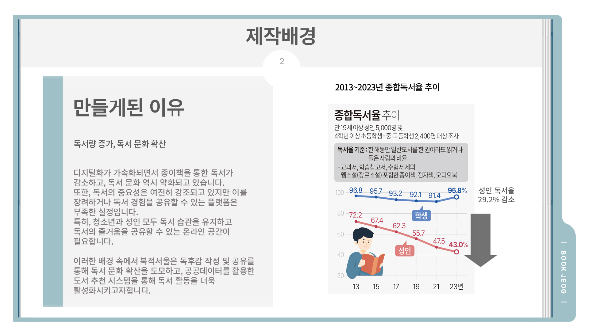
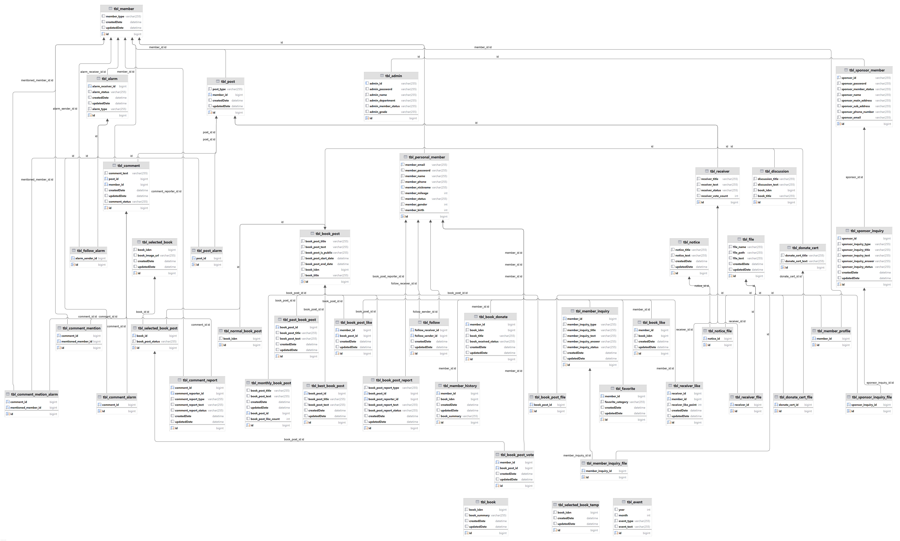
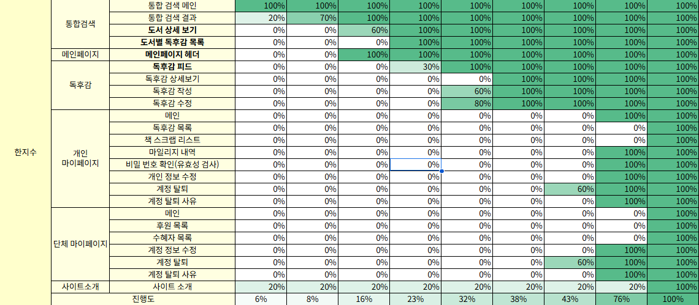
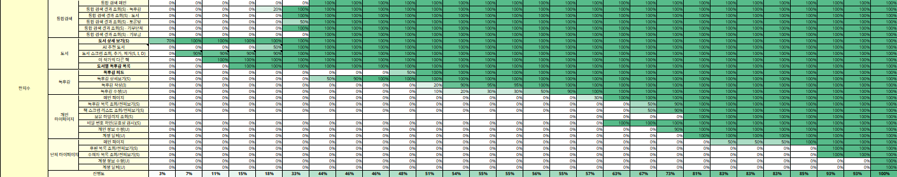
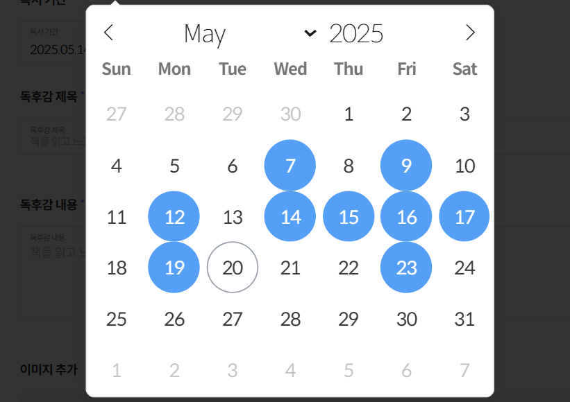
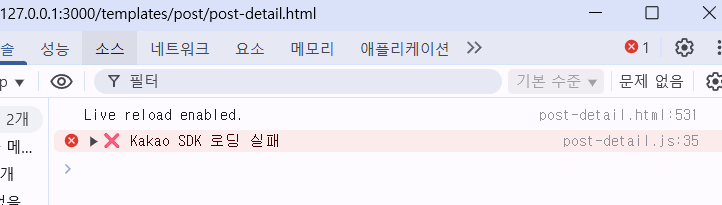
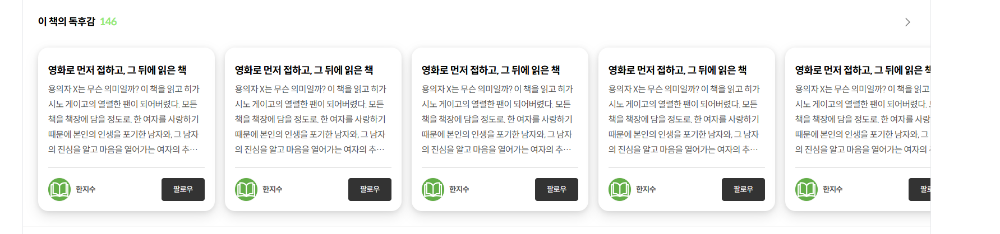
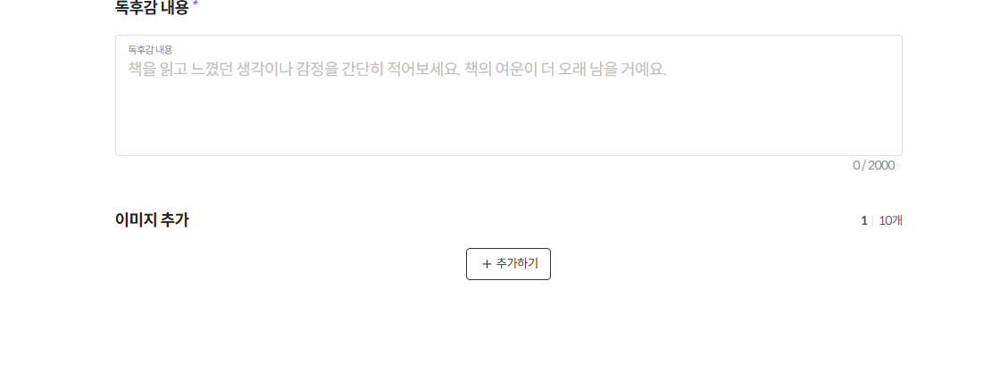

# bookjeogseoul

# 독서와 나눔이 공존하는 독서 커뮤니티, 북적서울.

## 1. 기획 의도


한국인들의 2013~2023년 종합독서율 추이를 조사해 봤을 때, 만 19세 이상 성인들의 독서율은 무려 <strong>29.2%</strong>나 감소한 <strong>43.0%</strong>였다.<br>
이는 한 해동안 책을 읽는 성인이 두 명 중에 한 명도 채 되지 않는다는 말이다.

이런 문제를 보고 종이책 독서율을 높이고 독서 문화를 확신시킬 수는 없을까 고민하게 되었다.

이에 따라 우리는 독후감으로 <strong>독서 경험을 공유</strong>하고 <strong>맞춤형 추천도서 시스템</strong>을 활용한 새로운 <strong>기부형 독서 플랫폼</strong>을 만들기로 하였다.

## 2. 기대 효과


모든 사람들에게 독서의 기회를 제공하고 사람들과 함께 독서에 참여할 수 있게 한다.

독서 활동의 보상으로 기부에 동참하게 만들며,
이는 독서를 할 때의 성취감과 동기부여가 된다.<br>
독후감으로 독서 경험을 공유하고 의견도 나눌 수 있으며,<br>
후원단체와의 연결을 통해 직접적으로 도서를 전달할 수 있는 기회도 제공한다.

## 3. 프로젝트 사용 툴

-   Java
-   JavaScript
-   Apache Tomcat
-   MySQL
-   Spring Boot
-   Visual Studio Code
-   DBeaver
-   IntelliJ
-   PyCharm
-   PyTorch
-   FastAPI
-   Sourcetree
-   git, github
-   JSON
-   Ajax
-   JDK 17.0.10
-   Aladin API
-   Slack

## 4. ERD



## 5. 담당 업무

#### 5-1 퍼블리싱


▶ 통합 검색 페이지

-   검색창 페이지
-   통합 검색 결과
-   카테고리별 검색 결과

▶ 도서 페이지

-   도서 상세정보(반응형)
-   도서로 써진 독후감들(반응형)

▶ 메인 페이지

-   고정 헤더(반응형)

▶ 독후감

-   독후감 피드
-   독후감 상세보기
-   독후감 작성
-   독후감 수정

▶ 개인 마이페이지

-   메인 정보영역
-   내 도서 스크랩 목록
-   마일리지 조회
-   비밀번호 확인
-   개인 정보 수정
-   계정 탈퇴
-   계정 탈퇴사유

▶ 후원단체 마이페이지

-   메인 정보영역
-   내 기부글/기부인증글 목록
-   비밀번호 확인
-   개인 정보 수정
-   계정 탈퇴
-   계정 탈퇴사유

▶ 사이트 소개

#### 5-2 서버


▶ 통합검색

-   검색기능, 쿠키로 검색기록 저장
-   항목별 검색어에 맞는 결과 조회(도서/독후감/토론방/단체/기부글)

▶ 도서 상세

-   알라딘 API를 사용한 도서 정보 조회
-   FastAPI를 사용하여 회원별 도서 조회 기록과 유사도 검색을 통한 AI 맞춤 도서 추천 시스템
-   도서별로 작성된 독후감 리스트
-   도서 스크랩, 해당 도서로 독후감 작성 기능
-   해당 도서를 쓴 작가의 다른 도서 목록

▶ 독후감

-   알라딘 API를 사용해 독후감을 작성할 도서를 검색
-   제목, 내용, 기간 등 독후감 필수 항목과 10개까지 첨부 가능한 첨부 이미지를 넣어 독후감 작성 기능 제공
-   독후감 공개여부, 선정도서면 독후감 투표 지원여부 선택 가능
-   작성한 독후감도 내용, 공개여부 등 수정 가능
-   다른 회원이 작성한 독후감은 조회 페이지에서 신고, 좋아요, 팔로우 가능

▶ 개인회원 마이페이지

-   프로필사진, 닉네임, 팔로우&팔로워와 작성한 독후감 개수, 마일리지 등 회원 정보 조회
-   회원별로 스크랩한 도서 목록을 마이페이지에서 조회 가능
-   회원 정보 변경 시 비밀번호 확인 후 페이지 이동
-   프로필사진 삭제, 변경과 이메일, 비밀번호 등 개인회원 정보를 조회 및 수정
-   내 활동내역 조회 후 탈퇴 기능

▶ 단체회원 마이페이지

-   대표 이미지, 단체 이름, 기부글 등 회원 정보 조회
-   작성한 기부글/기부인증글 마이페이지에서 조회 가능
-   회원 정보 변경 시 비밀번호 확인 후 페이지 이동
-   대표 이미지 삭제, 변경과 이메일, 비밀번호 등 개인회원 정보를 조회 및 수정
-   내 활동내역 조회 후 탈퇴 기능

## 6. 트러블 슈팅(오류, 해결)

## 6-1. 퍼블리싱

### 1. 문제

📌 캘린더 라이브러리에서 시작~끝 날짜 두 개가 선택이 안 되는 현상

```
const fp = flatpickr(dateInput, {
        mode: "multiple",
        dateFormat: "Y.m.d", // 예: 2025.04.03 형식
        appendTo: calendarContainer,
        onChange: function (selectedDates, dateStr, instance) {
            if (selectedDates.length === 2) {
                const start = instance.formatDate(selectedDates[0], "Y.m.d");
                const end = instance.formatDate(selectedDates[1], "Y.m.d");
                const rangeText = `${start} ~ ${end}`;
```

<문제 코드><br>
독후감 작성 페이지에서 flatpickr 라이브러리를 사용해 "시작일 ~ 종료일" 형식의 독서 기간을 지정하려고 했다.

<br>
<오류 화면><br>
의도한 동작이 되지 않고 여러 개의 날짜가 선택만 되는 상황 발생.

### 2. 해결

```
const fp = flatpickr(dateInput, {
        mode: "range", // 2025.04.03~2025.04.10 이렇게 기간을 설정
        dateFormat: "Y.m.d", // 예: 2025.04.03 형식
        appendTo: calendarContainer,
        onChange: function (selectedDates, dateStr, instance) {
            // 날짜가 두 개 모두 선택되면
            if (selectedDates.length === 2) {
                const start = instance.formatDate(selectedDates[0], "Y.m.d");
                const end = instance.formatDate(selectedDates[1], "Y.m.d");
                const rangeText = `${start} ~ ${end}`;
```

<완성 코드><br>
🔍mode: "range"를 사용하여 원하는 형식으로 기간을 지정했다.<br>

이렇게 하면 캘린더에서 날짜 두개를 클릭하여 지정했을 때,<br>
시작일~종료일로 기간을 설정할 수 있게 되었다.

✔ flatpickr의 mode 옵션에는 다음의 설정이 있다.<br>
`single` - 하나의 날짜만 선택할 수 있는 모드(기본값)<br>
`multiple` - 여러개의 날짜를 선택할 수 있는 모드<br>
`range` - 시작일과 종료일을 선택하여 기간을 선택하는 모드<br>
`time` - 날짜 없이 시간만 선택하는 모드<br><br>

### 1. 문제

📌 카카오로 링크 공유하기 버튼을 눌러도 아무 반응이 없고 에러로그가 뜸

```
document.addEventListener("DOMContentLoaded", () => {
    if (window.Kakao && !Kakao.isInitialized()) {
        Kakao.init("16c74ba60369da3eb1ee0b92f425d32e");
        console.log("Kakao 초기화 완료");
    } else if (!window.Kakao) {
        console.error("❌ Kakao SDK 로딩 실패");
        return;
    }
```

<문제 코드><br>
카카오톡 공유 기능을 위해 kakao developers에 있는 키를 정상적으로 입력했으나 "kakao 초기화 완료"라는 로그가 뜨지 않고 실행도 안 됨.

<br>
<오류 화면><br>
공유 버튼을 눌러도 실행이 안 되고 에러 로그만 출력.

### 2. 해결

```
        <!-- 카카오 공유 api -->
        <script src="https://developers.kakao.com/sdk/js/kakao.min.js"></script>
    </head>
    <body>
```

<완성 코드><br>
🔍카카오톡 공유 기능을 사용하기 위해 Kakao JavaScript SDK를 `<script>` 태그로 HTML에 직접 불러왔다.<br>

이 스크립트는 공유 버튼 클릭 시 Kakao.Share.sendDefault()와 같은 메서드를 사용할 수 있게 해주는 핵심 라이브러리다.

✔ 이 태그는 반드시 `<body>`보다 <strong>위쪽(head나 상단)</strong>에 위치해야 하며, Kakao.init() 호출 전에 로딩되어 있어야 한다.<br><br>

### 1. 문제

📌 슬라이드 요소가 스크롤되지 않음

```
.report-container .slide-container {
    overflow: hidden;
    cursor: grab;
    scrollbar-width: none;
    margin: 0 -24px;
}
```

<문제 코드><br>
`.slide-container` 안에 가로로 콘텐츠(예: 카드형 슬라이드)가 배치되어 있다.

<br>
<문제 화면><br>
마우스로 스크롤하거나 드래그하려 해도 전혀 움직이지 않음.

### 2. 해결

```
.report-container .slide-container{
    overflow: scroll; // 항상 스크롤 표시
    cursor: grab;
    scrollbar-width: none;
    margin: 0 -24px;
}
```

<완성 코드><br>
🔍overflow: scroll을 통해 영역이 컨테이너보다 크면 스크롤로 움직일 수 있게 하였다.<br>

슬라이드형 콘텐츠에서는 보통 overflow-x: `auto` 또는 `scroll`을 사용해 스크롤 동작을 허용해야 하며,<br>
내부 아이템의 레이아웃도 줄바꿈 없이 가로로 배치되도록 구성해야 한다.

✔ overflow: `hidden`은 스크롤바와 넘치는 콘텐츠를 완전히 숨겨서 스크롤 자체가 불가능하다. <br><br>

### 1. 문제

📌 이미지를 하나만 바꾸려 했지만 전체 미리보기가 날아가는 현상 발생

```
inputFile.addEventListener("change", () => {
    const file = inputFile.files[0];
    if (!file) return;

    const ext = file.name.split(".").pop().toLowerCase(); // 확장자명
    const allowed = ["jpg", "jpeg", "png"]; // 허용된 파일형식
    if (!allowed.includes(ext)) {
        alert("지원하지 않는 이미지 형식입니다.");
        return;
    }

    previewList.innerHTML = "";
    const newUrl = URL.createObjectURL(file);
    img.src = newUrl;
});
```

<문제 코드><br>
이미지 변경 버튼을 눌렀을 때, 특정 첨부파일의 이미지만 바꾸려 했다.

<br>
<오류 화면><br>
하나의 이미지 변경 시도 → 전체가 사라지고 새 이미지도 보이지 않는다.

### 2. 해결

```
inputFile.addEventListener("change", () => {
    const file = inputFile.files[0];
    if (!file) return;

    const ext = file.name.split(".").pop().toLowerCase(); // 확장자명
    const allowed = ["jpg", "jpeg", "png"]; // 허용된 파일형식
    if (!allowed.includes(ext)) {
        alert("지원하지 않는 이미지 형식입니다.");
        return;
    }

    const newUrl = URL.createObjectURL(file);
    // ✅ 전체 리스트를 지우지 말고, 해당 img 태그만 업데이트
    img.src = newUrl;
});
```

<완성 코드><br>
🔍`previewList.innerHTML = ""` 이 부분 때문에 원래 있던 `<li>`태그도 사라지는 것을 확인했다.<br>

"부분 변경"을 의도했지만, "전체 초기화" 방식이 코드에 들어간 것이다.<br>
그러하여 일부 변경을 위해 저 부분을 삭제하고 `img` 태그만 변경시키도록 수정했더니 의도대로 이미지 경로만 변화했다.

✔ 일부 이미지 변경 시에 innerHTML을 날리는 방법은 권장되지 않으며,<br>
해당 li 요소 내부의 `` 태그의 `src`만 바꾸는 것이 적절하다.<br><br>

### 1. 문제

📌 페이지를 아래로 스크롤했는데, 요소들이
아직 화면에 다 보이기 전에 애니메이션이 미리 끝나버림

```
const observer = new IntersectionObserver((entries) => {
    entries.forEach((entry) => {
        if (entry.isIntersecting) {
            entry.target.classList.add("active");
            floatBtn.classList.add("show");
        }
    });
});

fadeEls.forEach((el) => observer.observe(el));
```

<문제 코드><br>
`IntersectionObserver`를 사용해 특정 클래스의 요소들이 스크롤로 화면에 들어올 때
`.active`를 추가하여 애니메이션 효과를 발동하려 했다.

<br>
<문제 화면><br>
스크롤을 끝까지 내리지 않아도 애니메이션이 먼저 실행되어버림.

### 2. 해결

```
const observer = new IntersectionObserver(
    (entries) => {
        entries.forEach((entry) => {
            if (entry.isIntersecting) {
                entry.target.classList.add("active");
                floatBtn.classList.add("show");
            }
        });
    },
    {
        threshold: 0.2, // 이 부분 추가
    }
);
```

<완성 코드><br>
🔍`threshold: 0.2`를 추가해 스크롤이 요소의 20퍼만큼 내려오면 애니메이션이 발동되도록 만들었다.<br>

따로 `threshold`를 설정하지 않으면 요소가 화면에 단 1px만 걸쳐도 `isIntersecting`이 true가 된다.<br>
이로 인해 실제 사용자가 보기 전에 애니메이션이 시작되며, 화면 밖에서 끝나버리는 것처럼 보인다.

✔ `threshold`나 `rootMargin`을 사용하여 진입시 애니메이션을 자연스럽게 작동시킬 수 있다.<br><br>

